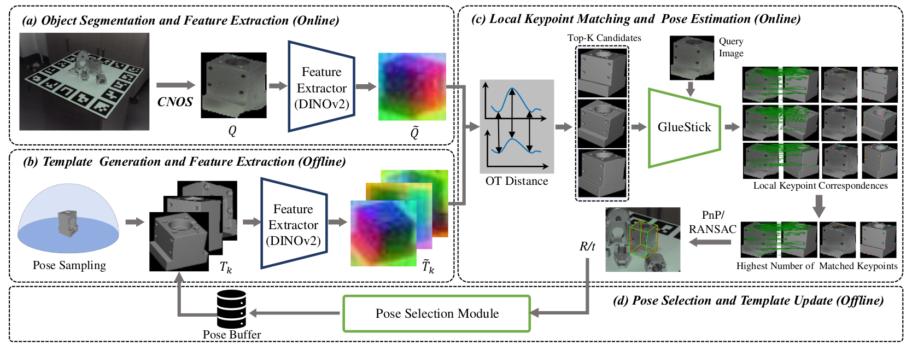
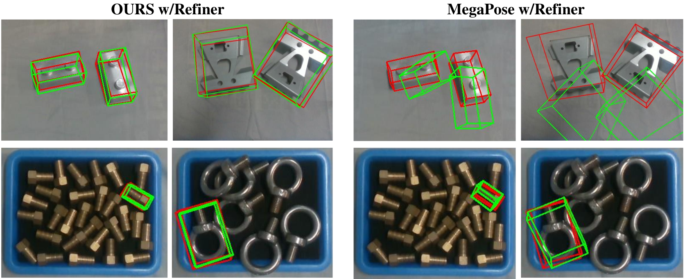

# IndusPose
Metal Parts’ Zero-Shot 6D Pose Estimation via Foundation Model and Template Update for Industrial Scenario



## Zero-shot Pose Estimation for Metal Parts
We provide the code for 6D pose estimation of novel metal parts using foundation model. 

Given as inputs: 
- an RGB image,
- the intrinsic parameters of the camera,
- a mesh of the object,
- a mask of that object in the image (bounding box is also ok)


# Installation
It is easy to install this code.
## 1. Clone the repository
The first step is to clone the repo and submodules:
```
git clone https://github.com/sunhan1997/IndusPose.git
```
## 2. Install the DepthAnything and GlueStick
- Install the [[bop_toolkit]](https://github.com/thodan/bop_toolkit) 
- Install the [[DepthAnything]](https://github.com/LiheYoung/Depth-Anything) and download the Depth-Anything-Large
- Install the [[gluestick]](https://github.com/cvg/GlueStick)
- Install the OT
```
pip install geomloss
```
## 3. Evaluation datasets:MP6D and ROBI
- [[MP6D]](https://github.com/yhan9848/MP6D) 
- [[ROBI]](https://www.trailab.utias.utoronto.ca/robi) 
- The scenes used in the paper for pose buffer and evaluation are shown in the DATASTE folder. 

# Run the demo

- Render the template
```
python my_render.py
```
- Estimate the metal parts' 6D pose
```
python run_pose.py
```

# Results in the real wrold

